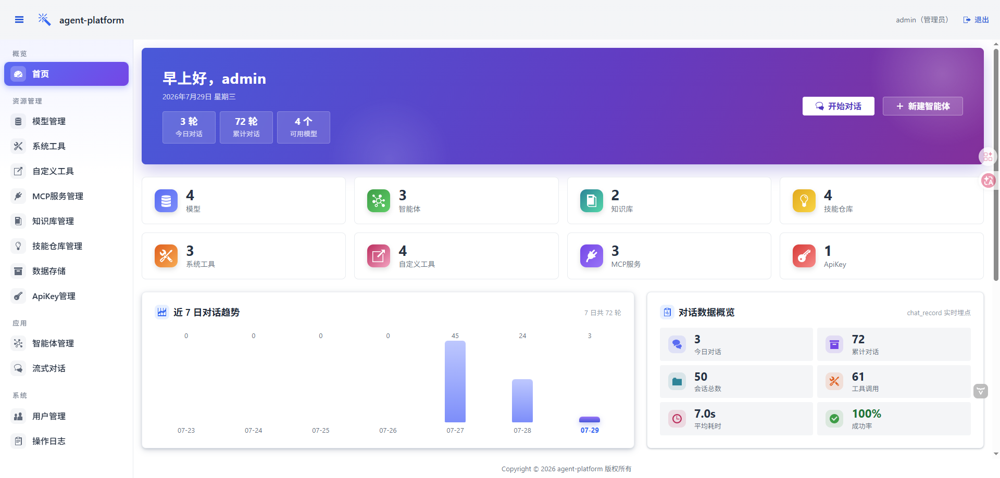

# agent-platform

基于 **AgentScope Java 2.0 + Spring Boot 3 + Vaadin 24 + MySQL + MyBatis-Plus** 的一站式智能体管理平台：模型、智能体、工具、MCP 服务、知识库、技能仓库统一配置，开箱即用的流式对话与数据看板。



## 功能特性

- **首页数据看板**（`/`）：渐变 Hero + 资源统计、近 7 日对话趋势、对话数据概览、活跃智能体排行、模型可用环图、快捷入口
- **模型管理**（`/models`）：CRUD；保存时真实调用验证可用性，支持重新检测；供应商覆盖 DashScope / Kimi / DeepSeek / GLM / MiniMax / OpenAI / Anthropic / Gemini / Ollama / 自定义
- **智能体管理**（`/agents`）：CRUD + 启用/禁用；每个智能体可挂载系统工具、自定义工具、MCP 服务、知识库、技能仓库；保存前确认弹窗
- **系统工具**（`/tools`）：扫描 `@Tool` 注解组件自动注册，内置查天气（wttr.in 真实数据）、联网搜索（必应）、查日期，不落库
- **自定义工具**（`/custom-tools`）：配置化 HTTP 工具，无需写代码即可接入任意 REST 接口
- **MCP 服务管理**（`/mcp`）：接入 MCP Server，工具自动并入所属智能体的工具箱
- **知识库管理**（`/knowledge`）：RAG 知识库配置，供智能体检索增强
- **技能仓库管理**（`/skills`）：支持 Git 远程仓库（如 [agentscope-ai/skills](https://github.com/agentscope-ai/skills)）与本地路径，按 AgentScope Skill 规范扫描 SKILL.md
- **流式对话**（`/chat`）：选择启用状态的智能体进行流式对话，每轮对话异步落库（`chat_record`）供看板统计
- **ApiKey 管理**（`/apikey`）：开放平台密钥管理
- **数据存储**（`/state-stores`）：会话状态存储（AgentStateStore）总览——内存 / 本地 JSON 文件 / Redis / MySQL 四种实现，展示配置与实时可用性；每个智能体创建时可独立选择，数据互相隔离
- **登录与权限**：sa-token 登录认证（会话持久化到 Redis）；多用户数据隔离，普通用户只见自己的资源，管理员看全部；用户管理、操作日志仅管理员可见
- **健康检查**：`/actuator/health` 及 K8s 探针 `/actuator/health/liveness`、`/actuator/health/readiness`（readiness 汇聚 db/redis 状态，依赖故障时探针失败自动摘流）

## 技术栈

| 组件 | 版本 |
|---|---|
| Java | 17 |
| Spring Boot | 3.3.4 |
| Vaadin | 24.4.x |
| AgentScope Java | 2.0.0 |
| MyBatis-Plus | 3.5.7 |
| Sa-Token | 1.39.0 |
| Hutool | 5.8.32 |
| MySQL | 8.x |
| Redis | 会话存储 |

## 快速开始

1. **初始化数据库**：本机安装 MySQL 8，依次执行两个脚本（建库建表 + 演示数据）：

   ```bash
   mysql -uroot -p < sql/agent_platform_schema.sql   # 建库建表（会 drop 重建整个库）
   mysql -uroot -p < sql/agent_platform_data.sql     # 演示数据（仅限全新库）
   ```

2. **准备依赖服务**：启动本地 Redis（sa-token 会话存储）；编辑 `src/main/resources/application.yml` 中的 `spring.datasource` / `spring.data.redis` 连接信息。

3. **启动**：

   ```bash
   mvn spring-boot:run
   ```

4. **访问**：浏览器打开 <http://localhost:8081>，使用内置管理员账号 **admin / admin123** 登录（首次启动自动创建，请登录后及时修改密码）。

## 打包部署

```bash
mvn clean package -Pproduction
java -jar target/agent-platform-1.0.0.jar
```

## 目录结构

```
├── sql/agent_platform_schema.sql # 建库建表
├── sql/agent_platform_data.sql   # 演示数据（schema 之后执行，仅限全新库）
└── src/main/
    ├── java/com/example/agent/
    │   ├── config/             # MyBatis-Plus 分页与字段填充、管理员初始化、启动注册智能体
    │   ├── system/
    │   │   ├── entity/         # 模型/智能体/知识库/MCP/技能仓库/用户/对话记录等 12 张表
    │   │   ├── mapper/         # BaseMapper + 看板统计 SQL
    │   │   ├── dto/            # ToolInfo、看板统计 DTO
    │   │   ├── agent/          # AgentRegistry、ModelFactory、MCP/知识库/技能工厂、可用性检测
    │   │   ├── auth/           # sa-token 登录、数据权限（租户过滤）
    │   │   ├── log/            # 操作日志注解 + AOP
    │   │   └── service/        # 业务逻辑 + ToolService（@Tool 扫描注册）
    │   ├── tool/               # 内置系统工具：WeatherTools、SearchTools、DateTimeTools
    │   └── ui/                 # MainLayout + 各管理页 + DashboardView / ChatView
    └── resources/
        ├── application.yml
        └── META-INF/resources/styles/  # 各页面独立样式（dashboard.css / chat.css / ...）
```

## 关键设计说明

- **智能体实例注册中心**（`AgentRegistry`）：每个启用状态的智能体按配置独立构建 `HarnessAgent` 并注册为 Spring 单例，创建时固化系统提示词、模型、工具箱、MCP 工具、知识库与技能仓库；新增/编辑重建、删除销毁，模型/MCP/知识库/技能仓库变更时级联重建引用它的实例；禁用状态的智能体不注册、不可对话。
- **系统工具解析**：`ToolService` 在 Spring 单例就绪后扫描所有 Bean，把带 `@Tool` 注解的方法反射注册进 AgentScope `Toolkit`。新增系统工具只需再写一个带 `@Tool` 注解的 `@Component`，重启生效。
- **技能仓库**：`GitSkillRepository` 克隆远程仓库到本地缓存目录（`localPath` 可指定持久位置），仓库根存在 `skills/` 子目录时优先扫描，只识别直接子目录中符合规范的 `SKILL.md`。
- **对话统计**：`ChatService` 每轮对话结束异步写入 `chat_record`（工具调用数、耗时、成功与否），看板的趋势/概览/活跃榜全部由它聚合，普通用户只统计自己名下智能体的数据。
- **会话状态存储**（`AgentStateStoreFactory`）：按智能体配置的 `state_store` 类型构建 AgentScope `AgentStateStore` 注入 HarnessAgent——内存（独立实例）、本地 JSON 文件（`workspaces/state/agent-<id>` 子目录）、Redis（每智能体 key 前缀）、MySQL（与主库同库的 `agentscope_sessions` 表，官方 userId:sessionId 寻址），四种实现之间数据互相隔离。
- **数据权限**：MyBatis 租户插件按当前登录用户自动过滤各表 `user_id`，管理员（`is_admin=1`）不过滤。
- **逻辑删除**：各表均有 `deleted` 字段，MyBatis-Plus 全局配置逻辑删除。
