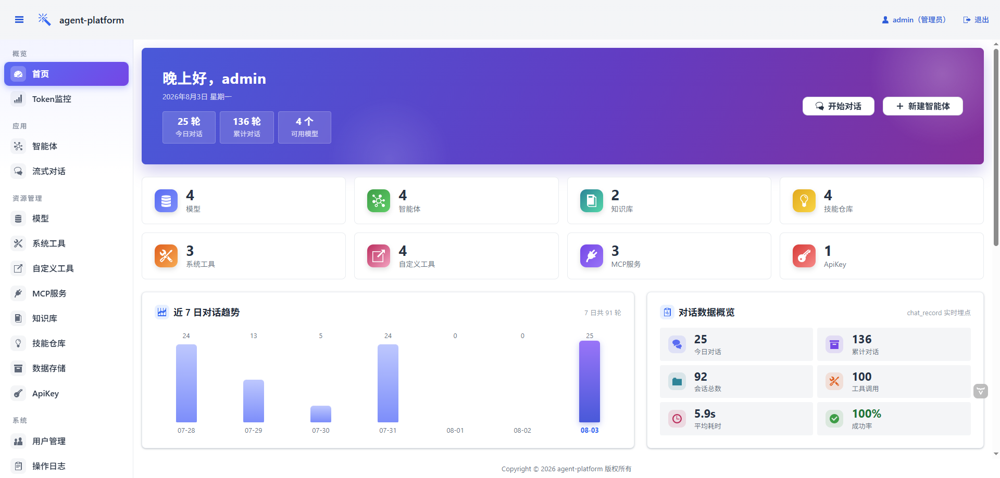
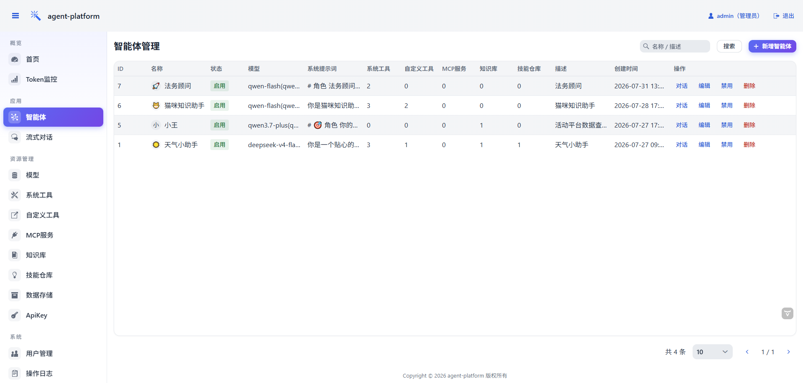
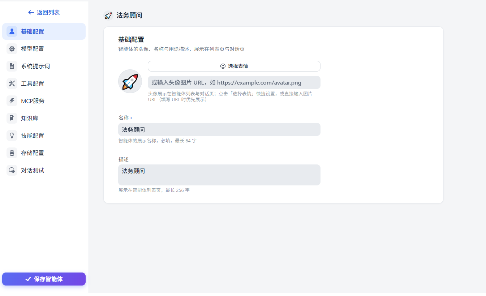
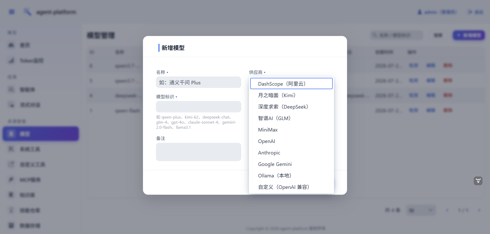
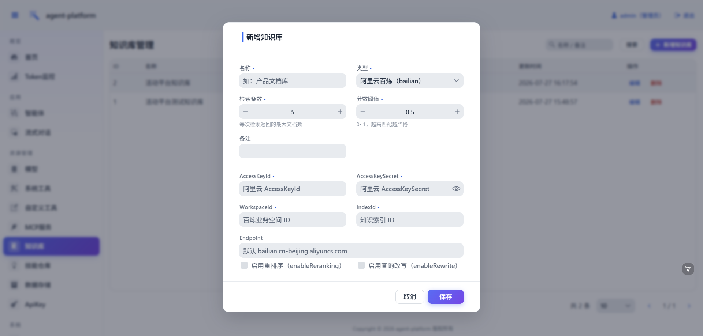
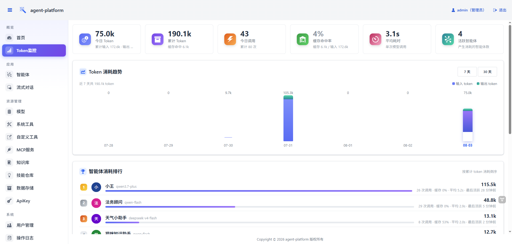

# Java 版智能体平台平替？我用 AgentScope 2.0 + Vaadin 撸了一个 agent 管理后台

想给智能体配个管理后台的时候，我先在 Java 生态里找了一圈现成的：Python 那边有 Dify、FastGPT，点几下就能用；Java 这边基本是空白，要么自己搭，要么咬牙切语言。

正好阿里 AgentScope Java 2.0 发了正式版，我基于它写了这个 agent-platform：模型、智能体、工具、MCP 服务、知识库、技能仓库全在页面上配置，自带流式对话和数据看板。写的过程中踩了不少坑，也攒下一些 AgentScope 2.0 的真实用法，发出来给同样不想切技术栈的 Java 同学当个参考。

## 技术栈

没有花活，全是 Java 后端熟悉的面孔：AgentScope Java 2.0 做智能体框架，Spring Boot 3 + MyBatis-Plus 写后端，MySQL + Redis + Sa-Token 管存储和登录态。前端用 Vaadin 24，纯 Java 写页面，全程没碰一行 JavaScript，对我这种看见 npm 就头疼的后端很友好。

## 平台里有什么

智能体管理是核心。每个智能体挂模型、提示词、工具、MCP 服务、知识库、技能仓库，保存立即生效，不用重启，不用的可以禁用。列表页直接显示每个智能体挂了几样资源：

新增和编辑不是弹框，是左右分栏的配置页：左边是基础配置、模型、提示词、工具、MCP、知识库、技能、存储这一排菜单，右边点一项配一项。每个字段下面都写了说明，不用翻文档猜含义。头像可以快捷选 emoji，也可以填图片 URL，选 emoji 那一下还挺欢乐的。

模型管理支持九家供应商：DashScope、Kimi、DeepSeek、GLM、MiniMax、OpenAI、Anthropic、Gemini、Ollama。保存时平台会拿填的 key 真实调一次接口，填错了当场报错，不会拖到对话时才发现。

知识库走 RAG 检索增强，目前支持阿里云百炼和 Dify 两种外部知识库。挂上之后，智能体拿到的是一个 retrieve_knowledge 工具，模型自己判断什么时候该去查，查到的内容带相关度分数。

Token 监控是我个人翻得最多的页面。每次模型调用的输入输出 token、耗时、缓存命中率都会落库，哪个智能体烧钱、烧多少，一眼就能看见。通过开放接口产生的消耗会按来源单独标记，内部使用和外部调用分得清。

剩下的几块简单带过：系统工具写一个带 @Tool 注解的 Spring 组件就自动注册，内置了天气（wttr.in 真实数据）、联网搜索和日期时间；自定义工具在页面上填 URL 和参数，能把任意 REST 接口包成工具，不用写代码；MCP 服务填个地址就能接入，工具自动并进智能体的工具箱；技能仓库支持 Git 远程仓库和本地路径，按 AgentScope Skill 规范加载；会话存储有内存、JSON 文件、Redis、MySQL 四种，每个智能体单独选，数据互相隔离。

如果要给外部系统用，还有一套开放接口：`/api/agent/**` 用 X-Api-Key 鉴权，提供 SSE 流式对话和会话管理，自带 Knife4j 在线文档。想自己写前端界面的，直接调这套接口就行，管理端登录态都不用碰。

## 实现上几个值得说的点

智能体实例是注册进 Spring 容器的。每个启用状态的智能体在后台构建成一个 HarnessAgent 单例，改配置就重建，删除就销毁。模型、知识库这类资源被修改时，引用它们的智能体会全部级联重建，整个过程不需要重启服务。

AgentScope 2.0 把旧的 RAG API 标成了废弃，新模块还没发布。我没有硬等：把废弃的那层（Knowledge 接口和工具包装）换成了自己的抽象，底层继续用官方扩展包里的百炼和 Dify 客户端。等官方新 RAG 出来，只需要替换实现层，工具层和页面都不用动。

对话事件流做了统一封装。管理端聊天和开放接口跑的是同一套事件序列：思考过程、文本增量、工具调用、工具结果、最终回答。前端照着事件类型渲染气泡和工具面板，不用解析字符串。

## 适合谁

团队主力语言是 Java，想要一个能改能扩的智能体平台底座；或者在研究 AgentScope Java 2.0，想找一个功能完整的参考项目，模型、工具、MCP、技能、RAG、SSE 都有真实可用的写法。哪怕只是想给自己的几个 agent 配个界面，不想碰 Python，也可以直接拿去用。

项目地址：<https://github.com/telzhou618/agent-platform>

MySQL 建库脚本和演示数据都在仓库里，导入后 `mvn spring-boot:run` 就能跑，默认账号 admin / admin123。觉得有用欢迎 star，有问题和想法也欢迎来 issue 里聊。
